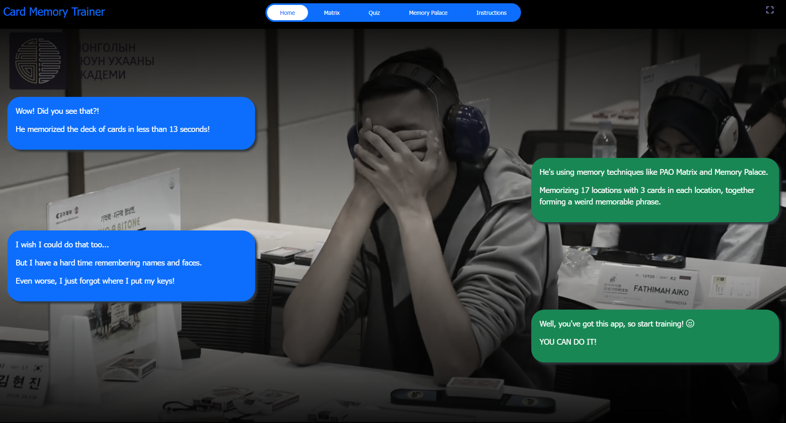
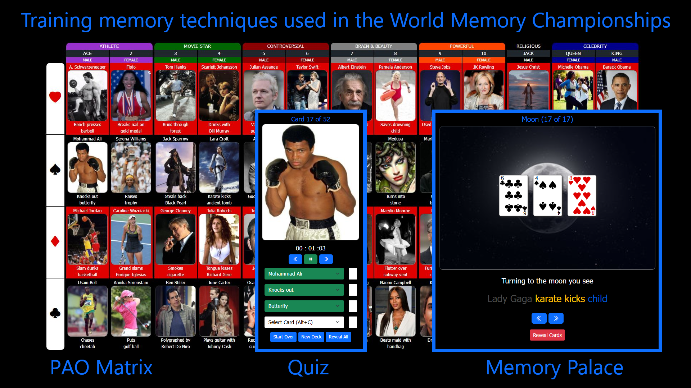

# Card Memory Trainer

<a href="https://www.youtube.com/watch?v=OApSOU7NIAw" target="_blank">Click here to view the YouTube of this Memory Championship.</a>

This simple web app helps you master memory techniques used by participants in the World Memory Championships, where they quickly (in less than 13 seconds) browse through a randomly shuffled deck of cards, memorize and recall the cards in chronological order.

Check out the [Wiki](https://github.com/RonniKahalani/CardMemoryTrainer/wiki) and [Discussions](https://github.com/RonniKahalani/CardMemoryTrainer/discussions).
